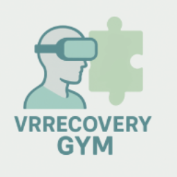

  

# UBU-VRRecoveryGym

**VRRecoveryGym** is a virtual reality application developed using Unreal Engine and C++ for motor rehabilitation.  

Its goal is to provide an accessible, motivating, and customizable rehabilitation experience in immersive environments.

## Authors

- Rodrigo Grande Muñoz

## Docs

Official documents on  [documentation](https://github.com/rodriso/VRRecoveryGym/blob/main/docs/memoria.pdf) and [anexes](https://github.com/rodriso/VRRecoveryGym/blob/main/docs/anexos.pdf)
## Contact

Feel free to contact me for any questions.

📨 Email [rgm1012](mailto:rgm1012@alu.ubu.es)

💼 LinkedIn [rogr](https://www.linkedin.com/in/rogr/)

## License

⚖️ [MIT](https://gitlab.com/HP-SCDS/Observatorio/2024-2025/vrrecoverygym/ubu-vrrecoverygym/-/blob/017b396afd3b4bb5e5fa4283dea1fe482b445a0a/LICENSE)

## In collaboration with

## Logo image

The image has been generated by AI.

